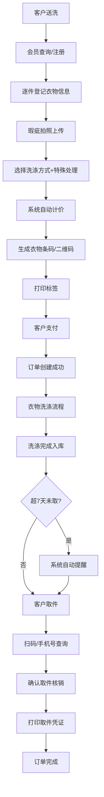

## 1. 产品概述

干洗店/洗衣店管理系统是一款面向中小型洗衣门店的一体化业务管理平台，解决门店运营中衣物登记混乱、标签管理困难、定价不透明、取件效率低、会员管理松散等痛点。

- 核心目标：实现衣物全生命周期数字化管理，提升门店运营效率和客户体验
- 目标用户：干洗店店主、前台收银员、门店运营人员
- 产品价值：减少人工操作失误，提升取件效率30%，降低衣物丢失/损坏纠纷率

## 2. 核心功能

### 2.1 用户角色

| 角色 | 注册方式 | 核心权限 |
|------|----------|----------|
| 门店管理员 | 系统预置账号 | 全部功能权限、系统配置、数据统计 |
| 前台收银员 | 管理员创建 | 衣物登记、打标签、取件核销、会员充值 |
| 会员客户 | 手机号注册/门店办理 | 查询订单、充值消费、查看积分 |

### 2.2 功能模块

1. **工作台首页**：今日订单概览、待取件提醒、营收统计、快捷入口
2. **衣物收件登记**：品类选择、颜色品牌录入、瑕疵拍照、洗涤方式选择、一衣一码标签打印
3. **订单管理**：订单列表、订单详情、状态流转、超期提醒
4. **取件核销**：扫码/手机号查询、批量取件、小票打印
5. **会员管理**：会员列表、会员详情、充值消费记录、积分管理
6. **定价配置**：品类定价、特殊处理附加费、会员折扣
7. **数据统计**：营收统计、品类分析、会员增长、超期取件统计

### 2.3 页面详情

| 页面名称 | 模块名称 | 功能描述 |
|----------|----------|----------|
| 工作台首页 | 数据看板 | 今日收件数、今日取件数、今日营收、待取件数 |
| 工作台首页 | 超期提醒 | 展示超7天未取衣物列表，一键发送提醒 |
| 工作台首页 | 快捷入口 | 收件登记、取件核销、会员充值、订单查询 |
| 衣物收件登记 | 客户信息 | 手机号查询/新会员注册、选择会员 |
| 衣物收件登记 | 衣物信息 | 品类（洗衣/干洗/水洗/熨烫/皮具护理/鞋子洗护）、颜色、品牌、瑕疵描述及拍照上传 |
| 衣物收件登记 | 洗涤配置 | 洗涤方式选择、特殊处理（去渍/漂白/整形等）附加费 |
| 衣物收件登记 | 标签打印 | 自动生成唯一衣物编码，支持条码/二维码标签打印预览 |
| 衣物收件登记 | 费用结算 | 自动计算总价、会员折扣、应收金额、支付方式 |
| 订单管理 | 订单列表 | 按状态/时间/手机号筛选，展示订单摘要 |
| 订单管理 | 订单详情 | 衣物明细、状态时间线、操作记录、费用明细 |
| 取件核销 | 查询取件 | 扫码枪扫描衣物码/输入手机号查询待取件订单 |
| 取件核销 | 确认取件 | 勾选衣物确认取件，批量核销，打印取件凭证 |
| 会员管理 | 会员列表 | 会员等级、余额、积分、消费次数统计 |
| 会员管理 | 会员详情 | 基本信息、充值记录、消费记录、积分明细 |
| 会员管理 | 会员充值 | 充值金额、赠送金额、支付方式、充值记录 |
| 定价配置 | 品类定价 | 各品类基础价格、不同衣物规格加价 |
| 定价配置 | 附加费配置 | 特殊处理项目及费用、加急费、超常规尺寸费 |
| 定价配置 | 会员折扣 | 不同会员等级对应折扣比例 |
| 数据统计 | 营收报表 | 日/周/月营收趋势、支付方式占比 |
| 数据统计 | 业务分析 | 各品类订单占比、洗涤方式分布 |
| 数据统计 | 会员分析 | 会员增长趋势、会员消费排行、储值余额分布 |

## 3. 核心流程

客户送洗衣物时，前台先通过手机号查询是否为会员，非会员可快速注册。然后逐件登记衣物信息（品类、颜色、品牌），对瑕疵部位拍照上传，选择洗涤方式和特殊处理项。系统自动计算每件衣物价格，生成唯一衣物编码并打印标签。客户支付后订单进入洗涤流程。衣物清洗完成后入库，系统自动记录入库时间。客户取件时通过扫码或手机号查询，确认无误后核销取件。超过7天未取的衣物系统自动高亮提醒，可一键发送短信通知会员。会员可随时到店或线上充值，享受对应等级折扣。

## 4. 用户界面设计

### 4.1 设计风格

- **主色调**：深海蓝 #1e3a5f（专业、可信赖），搭配薄荷绿 #3eb489（清新、洁净）作为强调色
- **辅助色**：暖橙色 #ff8c42 用于提醒和超期标识，浅灰蓝 #f0f4f8 作为背景色
- **按钮风格**：圆角 8px，主按钮为深海蓝渐变，悬浮时有轻微上浮和阴影加深效果
- **字体**：标题使用 Noto Sans SC 粗体，正文使用 Noto Sans SC 常规体，数据数字使用 JetBrains Mono
- **布局风格**：左侧导航栏 + 顶部状态栏 + 主内容区的经典后台布局，卡片式信息展示，大量留白
- **图标风格**：线性图标搭配色块背景，统一 24px 尺寸，圆角 6px

### 4.2 页面设计概述

| 页面名称 | 模块名称 | UI 元素 |
|----------|----------|----------|
| 工作台首页 | 数据看板 | 4个统计卡片并列，数字大号加粗，下方小字说明，背景为浅色渐变，悬浮有微动效 |
| 工作台首页 | 超期提醒列表 | 顶部橙色警示条，表格展示超期衣物，超期天数红色高亮，行尾"发送提醒"按钮 |
| 工作台首页 | 快捷入口 | 4个图标卡片 2x2 布局，图标+文字，点击有按压反馈 |
| 衣物收件登记 | 多步骤表单 | 步骤条导航，已完成步骤为绿色，当前步骤蓝色，每步完成有过渡动画 |
| 衣物收件登记 | 衣物信息卡 | 每件衣物一张卡片，支持动态增删，卡片间有分隔线，编号徽标 |
| 衣物收件登记 | 瑕疵拍照区 | 虚线框上传区域，支持拖拽，缩略图网格排列，悬停显示删除按钮 |
| 衣物收件登记 | 标签预览 | 右侧悬浮预览框，实时显示标签样式，模拟打印纸效果 |
| 取件核销 | 扫码区 | 大号扫描框动画，扫码线上下移动，支持手动输入切换 |
| 取件核销 | 待取件列表 | 可勾选的卡片列表，显示衣物缩略图、编码、送洗时间，底部汇总已选件数 |
| 会员管理 | 会员卡片 | 头像+等级徽章，余额积分突出显示，充值按钮醒目 |
| 数据统计 | 图表区 | 渐变面积图展示营收趋势，环形图展示品类占比，配色与主题一致 |

### 4.3 响应式

- 桌面端优先设计（1440px 基准），左侧固定导航栏宽度 240px
- 平板端（768px-1024px）导航栏收起为图标模式，主内容区自适应
- 移动端（<768px）导航栏变为底部 Tab 栏，表单改为单列布局，表格支持横向滚动
- 取件核销页针对扫码场景做触摸优化，按钮尺寸不小于 44px

### 4.4 动画与交互

- 页面加载时数据卡片依次淡入上浮（stagger 100ms）
- 表单步骤切换使用水平滑动过渡
- 衣物卡片新增/删除有缩放+透明度动画
- 扫码区有脉冲扫描线动画
- 按钮点击有 Ripple 波纹效果
- 超期提醒条目有轻微呼吸闪烁效果
