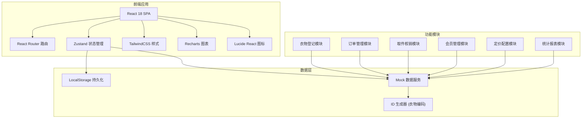
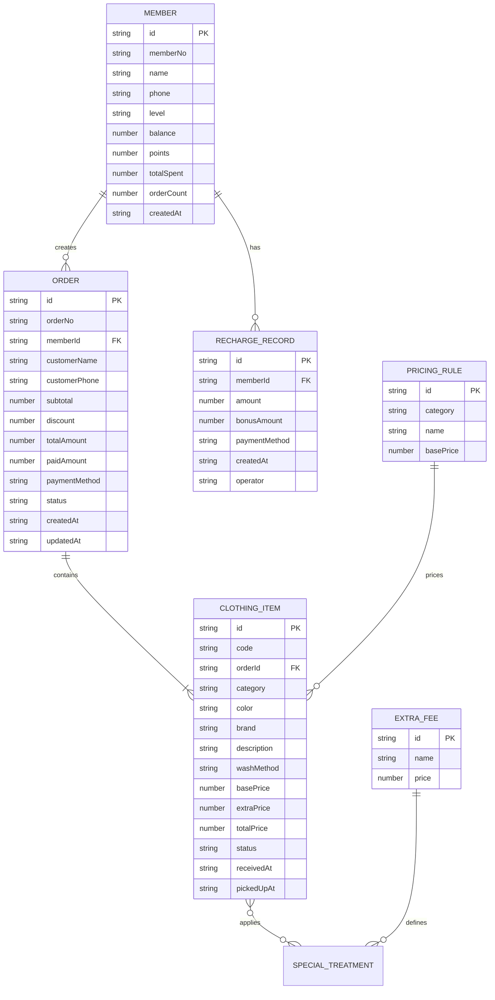

## 1. 架构设计



## 2. 技术描述

- **前端框架**：React@18 + TypeScript@5
- **构建工具**：Vite@5
- **样式方案**：TailwindCSS@3 + PostCSS
- **状态管理**：Zustand@4（轻量级，适合中小规模应用）
- **路由方案**：React Router@6
- **图表库**：Recharts@2（基于 React 的数据可视化）
- **图标库**：Lucide React@0.344
- **条码/二维码**：qrcode.react@3
- **UI 组件**：自研轻量组件（避免引入重型 UI 库）
- **数据存储**：LocalStorage + Mock 数据（无需后端，可直接演示完整功能）
- **图片处理**：FileReader API 实现本地图片预览

## 3. 路由定义

| 路由路径 | 页面组件 | 页面用途 |
|----------|----------|----------|
| / | Dashboard | 工作台首页 |
| /receive | ClothesReceive | 衣物收件登记 |
| /orders | OrderList | 订单列表 |
| /orders/:id | OrderDetail | 订单详情 |
| /pickup | PickupVerify | 取件核销 |
| /members | MemberList | 会员列表 |
| /members/:id | MemberDetail | 会员详情 |
| /members/recharge | MemberRecharge | 会员充值 |
| /pricing | PricingConfig | 定价配置 |
| /statistics | Statistics | 数据统计 |

## 4. 类型定义

```typescript
// 衣物品类
type ClothingCategory = 'laundry' | 'dry_clean' | 'wash' | 'iron' | 'leather' | 'shoes';

// 洗涤方式
type WashMethod = 'standard' | 'gentle' | 'deep_clean' | 'hand_wash';

// 订单状态
type OrderStatus = 'received' | 'washing' | 'ready' | 'picked_up' | 'overdue';

// 会员等级
type MemberLevel = 'normal' | 'silver' | 'gold' | 'platinum';

// 衣物信息
interface ClothingItem {
  id: string;
  code: string;
  category: ClothingCategory;
  color: string;
  brand: string;
  description: string;
  flawPhotos: string[];
  washMethod: WashMethod;
  specialTreatments: SpecialTreatment[];
  basePrice: number;
  extraPrice: number;
  totalPrice: number;
  status: OrderStatus;
  receivedAt: string;
  pickedUpAt?: string;
}

// 特殊处理项
interface SpecialTreatment {
  id: string;
  name: string;
  price: number;
}

// 订单
interface Order {
  id: string;
  orderNo: string;
  memberId?: string;
  customerName: string;
  customerPhone: string;
  clothes: ClothingItem[];
  subtotal: number;
  discount: number;
  totalAmount: number;
  paidAmount: number;
  paymentMethod: string;
  status: OrderStatus;
  createdAt: string;
  updatedAt: string;
  remark?: string;
}

// 会员
interface Member {
  id: string;
  memberNo: string;
  name: string;
  phone: string;
  level: MemberLevel;
  balance: number;
  points: number;
  totalSpent: number;
  orderCount: number;
  createdAt: string;
  rechargeRecords: RechargeRecord[];
}

// 充值记录
interface RechargeRecord {
  id: string;
  memberId: string;
  amount: number;
  bonusAmount: number;
  paymentMethod: string;
  createdAt: string;
  operator: string;
}

// 定价配置
interface PricingRule {
  category: ClothingCategory;
  basePrice: number;
  name: string;
}

interface ExtraFee {
  id: string;
  name: string;
  price: number;
  applicableCategories: ClothingCategory[];
}
```

## 5. 数据模型

### 5.1 ER 图



### 5.2 初始化数据

```typescript
// 默认定价规则
const defaultPricingRules = [
  { category: 'laundry', name: '普通洗衣', basePrice: 25 },
  { category: 'dry_clean', name: '干洗', basePrice: 45 },
  { category: 'wash', name: '水洗', basePrice: 20 },
  { category: 'iron', name: '熨烫', basePrice: 15 },
  { category: 'leather', name: '皮具护理', basePrice: 120 },
  { category: 'shoes', name: '鞋子洗护', basePrice: 35 },
];

// 默认附加费用
const defaultExtraFees = [
  { id: 'stain', name: '深度去渍', price: 20, applicableCategories: ['laundry', 'dry_clean', 'wash'] },
  { id: 'bleach', name: '漂白处理', price: 15, applicableCategories: ['laundry', 'wash'] },
  { id: 'reshape', name: '整形修复', price: 30, applicableCategories: ['iron', 'leather'] },
  { id: 'urgent', name: '加急服务', price: 25, applicableCategories: ['laundry', 'dry_clean', 'wash', 'iron', 'leather', 'shoes'] },
  { id: 'oversize', name: '超大件', price: 30, applicableCategories: ['laundry', 'dry_clean', 'wash'] },
];

// 会员折扣配置
const memberDiscounts = {
  normal: 1.0,
  silver: 0.95,
  gold: 0.9,
  platinum: 0.85,
};
```

## 6. 项目目录结构

```
src/
├── components/          # 通用组件
│   ├── Layout/          # 布局组件（侧边栏、顶栏）
│   ├── Card/            # 卡片组件
│   ├── Button/          # 按钮组件
│   ├── Modal/           # 弹窗组件
│   ├── Table/           # 表格组件
│   ├── Form/            # 表单控件
│   ├── Tag/             # 标签组件
│   └── Barcode/         # 条码/二维码组件
├── pages/               # 页面组件
│   ├── Dashboard/
│   ├── ClothesReceive/
│   ├── OrderList/
│   ├── OrderDetail/
│   ├── PickupVerify/
│   ├── MemberList/
│   ├── MemberDetail/
│   ├── MemberRecharge/
│   ├── PricingConfig/
│   └── Statistics/
├── store/               # Zustand 状态管理
│   ├── orderStore.ts
│   ├── memberStore.ts
│   ├── pricingStore.ts
│   └── appStore.ts
├── types/               # TypeScript 类型定义
│   └── index.ts
├── utils/               # 工具函数
│   ├── idGenerator.ts   # 衣物编码生成器
│   ├── priceCalculator.ts
│   ├── dateUtils.ts
│   └── storage.ts
├── mock/                # Mock 数据
│   ├── initialOrders.ts
│   ├── initialMembers.ts
│   └── initialPricing.ts
├── hooks/               # 自定义 Hooks
│   ├── useOverdueCheck.ts
│   └── useLocalStorage.ts
├── App.tsx
├── main.tsx
└── index.css
```

## 7. 核心功能实现要点

### 7.1 衣物编码生成
格式：`CC + YYYYMMDD + 4位序号`，如 `CC202606200001`，确保全局唯一。

### 7.2 超期检测
自定义 Hook `useOverdueCheck` 每小时自动扫描入库超过 7 天且未取件的衣物，更新状态并在首页展示提醒列表。

### 7.3 价格计算
工具函数 `calculatePrice` 接收衣物品类、特殊处理项、会员等级，计算：`(基础价 + 附加费总和) × 会员折扣`。

### 7.4 数据持久化
所有 Store 数据变更时自动同步到 LocalStorage，应用启动时从 LocalStorage 恢复。

### 7.5 响应式设计
TailwindCSS breakpoints：`sm`(640px) / `md`(768px) / `lg`(1024px) / `xl`(1280px)，移动优先但桌面端作为主要目标。
